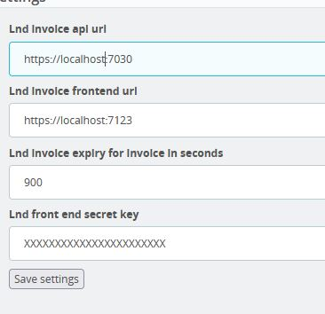

# LND Invoice with .net 6 minimal API / Blazor server-side frontend / Prestashop payment module

## Goal

Declare your LND node REST API on Tor and link it to your Prestashop.  

(No database, simple lnd invoice generator connected to your prestashop from your personnal node)

## How

One Visual Studio solution that contains:

* .net 6 minimal api => connection to your LND Node and gateway for the requests to your LND node REST API
* .net 6 Blazor server-side front end => invoice generation
* .net 6 Service library => used in Blazor and the minimal API

Outside of the Visual Studio solution:

* Prestashop module => connect to minimal api and the Blazor frontend (allow Lightning payments on your shop)

## Security

* Do not use if you don't know what you are doing.
* Don't expose the minimal .net 6 API, use it on your Prestashop (server / VPS) without any access from outside.
* The Blazor frontend needs to be installed on the same server + proxy redirection via nginx or Apache.
* Blazor server-side don't like POST request => some token to communicate with Prestashop are sent via QueryString (tripleDES).

## Config

### Preparation

* Expose your LND REST API on Tor Hidden Service (see Raspibolt github maybe)
* Extract your LND invoice macaroon

Macroon extraction:
```xxd -ps -u -c 1000 /path-to-lnd/data/chain/bitcoin/mainnet/invoice.macaroon```

### Minimal .net 6 api

```json
  "LndConnectionSettings": {
    "OnionAddress": "https://youronionhere.onion",
    "LndRestApiPort": "8080",
    "TorSocks5Proxy": "127.0.0.1",
    "TorSocks5ProxyPort": "9150",
    "InvoiceLndMacaroon": "your Lnd invoice macaroon str here"
  }
```

### Blazor server side

```json
  "ApiConnectionSettings": {
    "LndInvoiceApiAdress": "https://localhost:7030/",
    "SecretKey": "your prestashop module secret key"
  }

```

### Prestashop

Install the module and configure it to match the configuration you need (Secret key, urls of Blazor and minimal APi)


